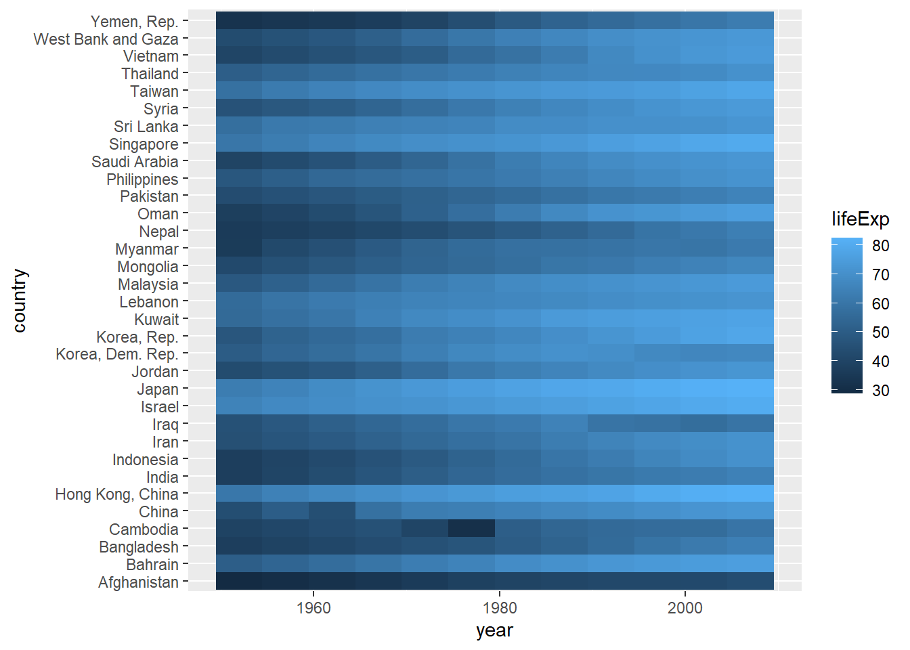
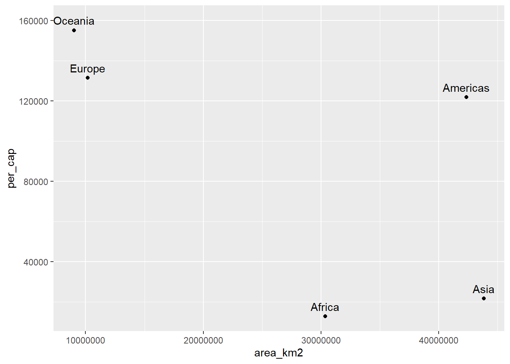

# Exercícios {-}

(@) **Alguns pacotes possuem data frames para uso nos exemplos. Carregue o pacote `gapminder` aplique a função `glimpse` na objeto `gapminder` que pertence ao respectivo pacote.**


```
#> Rows: 1,704
#> Columns: 6
#> $ country   <fct> "Afghanistan", "Afghanistan", "Afghanistan", "Afghanistan", …
#> $ continent <fct> Asia, Asia, Asia, Asia, Asia, Asia, Asia, Asia, Asia, Asia, …
#> $ year      <int> 1952, 1957, 1962, 1967, 1972, 1977, 1982, 1987, 1992, 1997, …
#> $ lifeExp   <dbl> 28.801, 30.332, 31.997, 34.020, 36.088, 38.438, 39.854, 40.8…
#> $ pop       <int> 8425333, 9240934, 10267083, 11537966, 13079460, 14880372, 12…
#> $ gdpPercap <dbl> 779.4453, 820.8530, 853.1007, 836.1971, 739.9811, 786.1134, …
```
<br>

(@) **Importe o arquivo `continents.xlsx` e mostre seu conteúdo na tela.**


```
#> # A tibble: 6 × 4
#>   continent  area_km2 population percent_total_pop
#>   <chr>         <dbl>      <dbl>             <dbl>
#> 1 Africa     30370000 1022234000              15  
#> 2 Americas   42330000  934611000              14  
#> 3 Antarctica 13720000       4490               0  
#> 4 Asia       43820000 4164252000              60  
#> 5 Europe     10180000  738199000              11  
#> 6 Oceania     9008500   29127000               0.4
```
<br>

(@) **Faça um join entre a tabela `gapminder` e `continents`, onde `gapminder` será a tabela de referência. Salve essa operação em um objeto chamado `gap_cont`.**


```
#> # A tibble: 1,704 × 9
#>    country     continent  year lifeExp      pop gdpPercap area_km2 population
#>    <fct>       <chr>     <int>   <dbl>    <int>     <dbl>    <dbl>      <dbl>
#>  1 Afghanistan Asia       1952    28.8  8425333      779. 43820000 4164252000
#>  2 Afghanistan Asia       1957    30.3  9240934      821. 43820000 4164252000
#>  3 Afghanistan Asia       1962    32.0 10267083      853. 43820000 4164252000
#>  4 Afghanistan Asia       1967    34.0 11537966      836. 43820000 4164252000
#>  5 Afghanistan Asia       1972    36.1 13079460      740. 43820000 4164252000
#>  6 Afghanistan Asia       1977    38.4 14880372      786. 43820000 4164252000
#>  7 Afghanistan Asia       1982    39.9 12881816      978. 43820000 4164252000
#>  8 Afghanistan Asia       1987    40.8 13867957      852. 43820000 4164252000
#>  9 Afghanistan Asia       1992    41.7 16317921      649. 43820000 4164252000
#> 10 Afghanistan Asia       1997    41.8 22227415      635. 43820000 4164252000
#> # ℹ 1,694 more rows
#> # ℹ 1 more variable: percent_total_pop <dbl>
```
<br>


(@) **Com base no objeto `gap_cont`, filtre as informações do continente `Oceania`.**


```
#> # A tibble: 24 × 9
#>    country   continent  year lifeExp      pop gdpPercap area_km2 population
#>    <fct>     <chr>     <int>   <dbl>    <int>     <dbl>    <dbl>      <dbl>
#>  1 Australia Oceania    1952    69.1  8691212    10040.  9008500   29127000
#>  2 Australia Oceania    1957    70.3  9712569    10950.  9008500   29127000
#>  3 Australia Oceania    1962    70.9 10794968    12217.  9008500   29127000
#>  4 Australia Oceania    1967    71.1 11872264    14526.  9008500   29127000
#>  5 Australia Oceania    1972    71.9 13177000    16789.  9008500   29127000
#>  6 Australia Oceania    1977    73.5 14074100    18334.  9008500   29127000
#>  7 Australia Oceania    1982    74.7 15184200    19477.  9008500   29127000
#>  8 Australia Oceania    1987    76.3 16257249    21889.  9008500   29127000
#>  9 Australia Oceania    1992    77.6 17481977    23425.  9008500   29127000
#> 10 Australia Oceania    1997    78.8 18565243    26998.  9008500   29127000
#> # ℹ 14 more rows
#> # ℹ 1 more variable: percent_total_pop <dbl>
```
<br>

(@) **Faça um heatmap considerando apenas os países da `asia`, onde no eixo x temos o `year`, no eixo y o `country` e na dimensão de preenchimento `lifeExp`.**

Dicas: filter, geom_tile.




(@) **Faça um gráfico de dispersão da area do continente e a renda per capta média do continente. Lembre-se que ao computar a renda média do continente a partir dos países, precisamos ponderar pela população de cada país. A renda per capta é a variável `gdpPercap`. A área está na variável `area_km2` do objeto `continents`. Faça o gráfico proposto logo abaixo.**

Dicas: mutate, group_by, summarize, left_join, geom_text e o parâmetro nudge_y.




